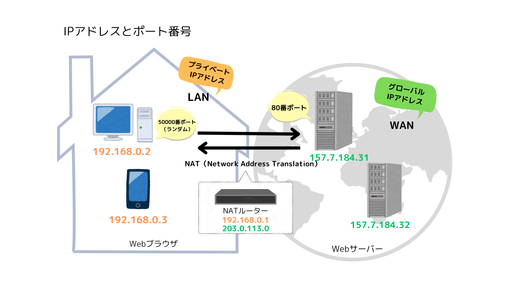

【Web】IP アドレスとポート番号

ネット検索をした場合、HTTP レスポンスを  
どの家に返すかはグローバル IP アドレスでわかる。  
この家のどの Web ブラウザに返すかは、プライベート IP アドレスでわかる。  
どのアプリケーション(サービス)と通信するかは、ポート番号でわかる。

# IP アドレスとは

IP アドレスとは、
コンピュータごとの識別番号のこと。  
よく住所に例えられる。  
接続したコンピュータを指定できるが、そのサービスまでは指定できない。

- 現在 IPv4 というプロトコルで通信している。今後番号が不足するので IPv6 が広まりつつある。
- 本来は 32 ビットの 2 進数の数字で表現されるが、人間が読みやすくするため 10 進数に変換して表示される。  
  例：10101100.11011001.10101111.01000011 → 172.217.175.67

- グローバル IP アドレスとは、

  - WAN での通信でインターネットサービスプロバイダから割り当てられる IP アドレス。
  - 世界中でアドレスの重複はない。
  - ICANN やその下部組織が管理している。

- プライベート IP アドレスとは、
  - LAN の中の通信で割り当てられる IP アドレス。
  - パソコン起動と同時に自動で割り当てられ、一つの LAN 内で重複さえしなければ同じ IP アドレスを利用できる。
  - インターネットへのアクセスが必要な場合、ルーターがグローバル IP アドレスに変換する。
  - インターネットから直接アクセスできないので、セキュリティーが高い。

| プライベート IP アドレスの範囲 | クラス分類 | 用途                |
| ------------------------------ | :--------- | :------------------ |
| 10.0.0.0 〜 10.255.255.255     | クラス A   |                     |
| 172.16.0.0 〜 172.31.255.255   | クラス B   |                     |
| 192.168.0.0 〜 192.168.255.255 | クラス C   | 家庭用ルーター      |
|                                | クラス D   | IP マルチキャスト用 |
|                                | クラス E   | 実験用              |

☀︎ ネットワークの規模や必要性に応じて決める。

# ポート番号とは

ポート番号とは、  
IP アドレスの下に配置されている補助的なアドレスのこと。  
TCP/IP においてコンピューター内部で動作するサービスを識別できる。
よく部屋番号やドアに例えられる。

- 16 ビットの 2 進数で表現され、0〜65535 までの識別番号が割り当てられている。

| ポート番号の範囲 | ポートの分類       | 説明                             |
| ---------------- | :----------------- | :------------------------------- |
| 0~1023           | ウェルノウンポート | 一般的なソフトウェアで使用       |
| 1024~49151       | レジスターポート   | メーカー独自のソフトウェアで使用 |
| 49152〜65535     | ダイナミックポート | クライエント側で自由に使用できる |

☀︎ 代表的なポート番号 ☀︎

「20」・・・FTP（ファイル転送用）
「21」・・・FTP（ファイル制御用）
「22」・・・SSH
「25」・・・SMTP（メール送信）
「80」・・・HTTP
「110」・・・POP3（メール受信）
「443」・・・HTTPS

# ドメインとは

ドメインとは、  
IP アドレスは覚えにくいので、別名として利用される。

- 世界中に同じドメインは存在しない。
- ドメインを利用してコンピュータに接続するときは、ドメインを IP アドレスへと変換する必要がある。(DNS という)

---

#### 参考にしたサイト

- [IP アドレス](https://www.value-domain.com/media/ipaddress/)
- [ポート番号](https://web773.hatenablog.com/entry/2021/06/27/075655)
- [NAT](https://novablog.work/how-does-the-internet-work/)
