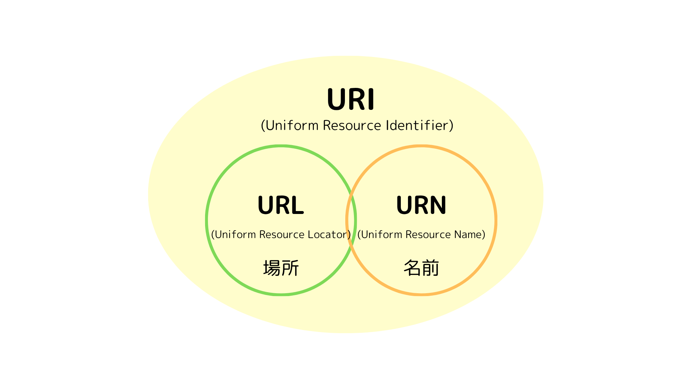

# 【Web】URI・URL・URN の違い

# URI とは

URI とは、インターネット上の情報資源（リソース）を識別するための記述方法。
URL と URN の総称。

- 構文は、スキームと呼ばれる識別子(http)、コロン(:)、スキームごとの表現形式(//以降)で記述される。  
  例: http://example.com/news/index.html  
  （example.com にある news フォルダ内の index.html ファイルという意味）

- リクエスト URI とは、

  - HTTP の通信でリソースを特定するために利用される URI。
    HTTP リクエストの一行目(リクエスト行)に書かれている。

  - プロキシサーバーを経由する場合は、絶対 URI 形式で記述する。（http://から始まる）
  - 通常の場合は、相対 URI 形式で記述する。（/から始まる）

- URL エンコードとは、  
  URI で利用できる文字は定められており予約文字と非予約文字しか使えないため、
  どちらでもない文字を使う場合は変換すること。パーセントエンコード。
  - 元の文字に戻す変換は URL デコードという。
  - 予約文字は特別な役割を持つ文字で、他の用途で使いたいときは変換する。
  - 非予約文字は自由に使っていい文字。
  - 表記できない文字の文字コードを 16 進数で表し、「％xx」の形式に変換する。  
    例: スペース → %20

# URL とは

URL とは、インターネット上のリソースが存在する場所を示すもの。

- Web サイトの場所を示す際に使われる Web アドレス。
- その他、インターネットや LAN などのネットワーク上にあるデータやファイルの場所と、それらを取得方法を指定(検索)するためにも使われる。

#### URL の構文

例: http://example.com:80/test.html/?page=2#rev

**① スキーム名**・・・プロトコルを指定する。「http」「https」「ftp」など。
**② ホスト名**・・・③ のネットワーク上のコンピュータにつける識別用の文字列。「www」省略可能。  
**③ ドメイン名**・・・ネットワークを特定するための文字列。「example.com」  
**④ ポート番号**・・・接続先のサーバーのポート番号を指定する。「:80」通常は省略される。  
**⑤ パス名**・・・接続先のサーバーのディレクトリやファイルを指定する。「test.html」  
　パスパラメーターとは、URL パスの一部を変数として利用するパラメータのこと。
**⑥ クエリパラメーター**・・・追加の情報を Web サーバーに伝えるために URL の最後尾に付け加える情報。クエリ文字列ともいう。  
「?page=2」。任意の項目。
**⑦ フラグメント識別子**・・・リソース内の特定の部分を指定するとき。最後に付く#以降の部分。 「#rev」。任意の項目。
Web ブラウザは#以降の記述を読み取ると、その部分をページ内リンクとして認識し、指定された行までスクロールする。

☀︎② ホスト名と ③ ドメイン名をつなげたものを**完全修飾ドメイン名**という。FQDN(Fully Qualified Domain Name)。「www.example.com」のこと。

# URN とは

URN とは、
URI のうち場所は問わずにリソースそのものの名前を示すもの。

- URN はリソースの場所が変わっても識別子は変わらないので、常に同じ名前で識別できる。
- 書籍の ISBN 番号、学術論文など長期間参照するものに使用される。  
   例: urn:isbn:0-123-45678-9  
  （isbn コード 0-123-45678-9 で示される書籍という意味）

---

#### 参考にしたサイト

- https://medium-company.com/uri/
- https://zenn.dev/eri_agri/articles/859a3362db8386
