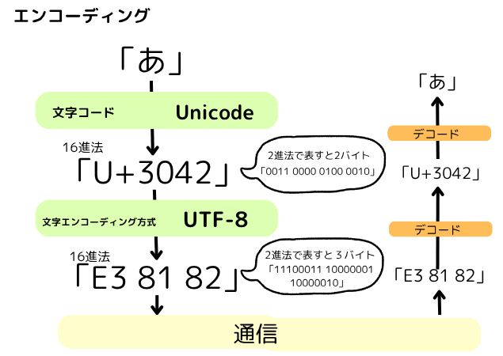

# 【Web】エンコーディングと文字コード

一般的にエンコーディングとは、  
テキストデータをバイナリデータに変換するプロセスである「文字エンコーディング」を指す。

- 文字化けの防止のために行う。
- UTF-8 の使用が推奨されている。

# エンコーディングとは

エンコーディングとは、  
データを一定の規則に従って目的に応じた情報に変換すること(符号化)。

- **エンコード**とは、エンコーディングを行う処理。
- **デコード**とは、エンコードされたデータを元の形式に戻す処理（復号）。

- エンコーディングの種類

  - 文字エンコーディング・・・  
    人間が理解できるテキストをコンピューターが理解できる形式（0 と 1）に変換すること。  
    どの文字コード（Unicode など）を使用し、どのような文字エンコーディング方式で表示する（UTF-8 など）かを定義する。
    符号化方式。

  - HTML エンコーディング・・・  
    HTML として特殊な意味を持つ文字を、意味を持たない別の文字列に変換すること。  
    HTML コード内でタグや特殊文字を表現することができるようになる。  
    例：「<」→「<」に変換。

  - URL エンコーディング・・・  
    URL で使用できない文字や特殊な意味を持つ文字を、パーセント記号とそれに続く 16 進数の組み合わせに変換すること。  
    ％エンコーディング。  
    例：あ → %E3%81%82 スペース → %20

# 文字コードとは、

文字コード(文字エンコード)とは、  
コンピュータで処理するために文字に数値を割り当てた対応表。
その数字のこと。符号化文字集合。

☀︎ 文字コードの種類 ☀︎
・ ASCII・・・基礎になる文字コード。アルファベット、数字、記号のみで表現する。
・ Unicode・・・世界中の文字に対応した世界共通文字コード。国際基準となっている。
・ EUC-JP・・・UNIX/Linux 系システムで利用される日本語の文字コード
・ JIS(ISO-2022-JP)・・・電子メールで利用される日本語の文字コード。
・JIS X 0208・・・日本語の漢字、ひらがな、カタカナを含む文字コード。

- エスケープ文字とは、  
  その言語にとって特別な意味を持つ文字や記号を、別の文字列に置き換えることで特別な意味を無効にしてくれる文字。特別な意味を付与する場合もある。  
  例：HTML で「<」→「&amp;lt;」  
   JavaScript などで「\n」→ 改行の意味を付与

# 文字エンコーディング方式とは

文字エンコーディング方式とは、  
文字コードで割り当てた数値（コードポイント）をバイト列に変換するルールを決める方式。
文字符号化方式。

☀︎ 文字エンコーディング方式の種類 ☀︎
・UTF-8・・・Unicode に対応し、1〜4 バイトで表現する方式。
・UTF-16・・・Unicode に対応し、2 または 4 バイトで表現する方式。
・ Shift_JIS・・・JIS X 0201 と JIS X 0208 に対応する方式。日本語 Windows OS 環境で使用される。

---

#### 参考にしたサイト

- https://step-learn.com/article/fundamental/072-char-encode-code.html
- https://breezegroup.co.jp/202004/encoding/
