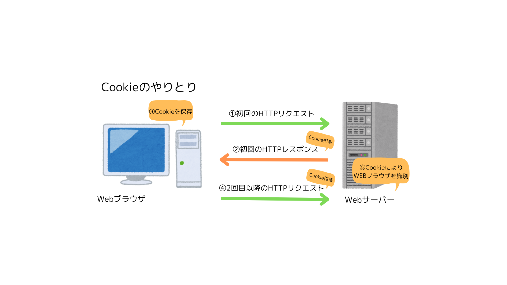
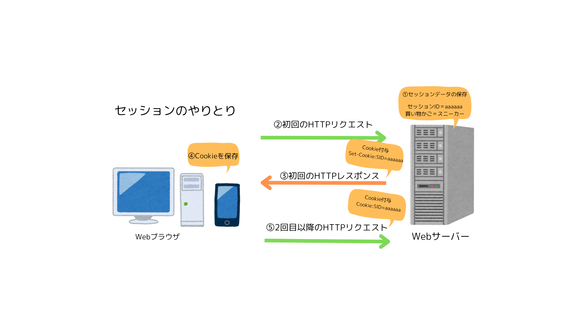

# 【Web】データ管理の仕組み

HTTP はステートレスなプロトコルであり、やりとりは 1 回ごとに完結した処理とみなされている。
状態を保持しないためサーバーの負担が小さく、多くの処理を素早く行うことができる。

↓

Web の進化により、  
ショッピングカートのように状態を保持しておく機能（ステートフル）が必要になった。

↓

クッキーやセッション、Web ストレージという  
HTTP を補完する仕組みが導入された。

# Cookie (クッキー)とは

クッキーとは、  
サイトを閲覧した時に作成されるデータを、Web ブラウザで一時的に保管しておく小さなテキストファイルのこと。
主にログイン ID や閲覧履歴、訪問回数などユーザーの固有の情報を保存する。  
1 つの Cookie に保存できるデータ量は約 4KB と少ない。

- クッキーの種類
  - 1st Party Cookie・・・閲覧している Web サイトのドメインが発行する自社の Cookie
  - 2nd Party Cookie・・・1st と 3rd の中間
  - 3rd Party Cookie・・・訪問した Web サイト以外のドメインから発行される Cookie
     
- メリット
  - スムーズな Web サイトへのログイン
  - EC サイトにおける利便性向上
  - ユーザーごとのコンテンツ表示最適化
  - 広告配信システムにおける適切なターゲティング
- デメリット
  - Cookie を発行した事業社にも保存されるため、不正利用や不正アクセスのリスク
  - 紛失したときに他人が EC サイトで商品を購入可能
  - 3rd パーティクッキーはプライベート保護の観点から、今後の広告配信への活用が難しくなっている。
     
- Cookie のやりとり
  - Cookie はメッセージヘッダーに含めて送信される。

☀︎Cookie のためのヘッダーフィールド ☀︎
Cooklie・・・リクエストヘッダーフィールド。初回のやりとりで Web サーバーから受け取った Cookie の値。
Set-Cookie・・・レスポンスヘッダーフィールド。状態を管理するための情報を示す。属性を付与できる。  
 expires 属性・・・Cookie の有効期限を指定するもの。  
 domain 属性・・・Cookie が有効なドメイン名を指定するもの。
secure 属性・・・HTTPS 通信をしている場合のみ Cookie を送信するようにする。

- セッション Cookie とは、  
  有効期限が設定されていない Cookie のこと。Web ブラウザを閉じると同時に削除される。

# session(セッション)とは

セッションとは、  
一連の関連性のある処理の流れのこと。ログインからログアウトまで。  
情報は Web サーバーに一時的に保存している。  
セッションはサーバー側に保存するため、大量のデータの保持が可能。

- **セッションデータ**とは、セッション内で行われた処理（買い物かごの内容）。  
  セッション ID と紐づいて Web サーバーに保存される。

- **セッション ID**とは、ユーザーごとのセッションを一意に識別するための鍵。
  Web サーバーで生成され、Cookie に含めて Web ブラウザに送信される。

- Web ブラウザは、リクエストを送信するとき、毎回 cookie にセッション ID を含めて送信することで、セッションを維持できる。

- ユーザーがログアウトしたりセッションが一定時間経過した場合、セッションは終了されセッションデータは削除される。

- セッションハイジャックとは、セッション ID が盗まれシステムを使用されること。

# cache(キャッシュ)とは

キャッシュとは、  
一度アクセスした Web ページの情報を保存しておく仕組み。  
毎回多くのデータを読み込む必要がなくなるため、再度アクセスするときに素早く表示できる。  
Web サーバーの負荷を減らす。

- キャッシュの種類

  - ブラウザキャッシュ・・・一度アクセスした情報を Web ブラウザに保存しておく仕組み
  - サーバーキャッシュ・・・ブラウザからのリクエストに対して返すレスポンスのデータを、Web サーバーに保存しておく仕組み

- **キャッシュサーバー**とは、  
  リクエストに対するレスポンスを記憶し、次回そのレスポンスを迅速に返す役割を持つサーバー。
  記憶していないリクエストは Web サーバに転送する。

- **コンテンツキャッシュ**とは、  
  文書や画像、動画といったコンテンツのキャッシュ。  
  CDN(Contents Delivery Network)とは、世界各地に配置されたコンテンツキャッシュサーバーの集合体。

- **クエリキャッシュ**とは、  
   DBMS (データベース管理システム)のデータ検索要求(クエリ)の結果のキャッシュ。
  クエリキャッシュサーバーは、AP サーバーからのクエリと DBMS のレスポンスの組み合わせを記憶しておく。

# Web ストレージとは

ウェブストレージとは、  
Web サイトで扱うデータを、Web ブラウザに保存しておく仕組みのこと。  
cookie やセッションの代わりになる手段として作られた。
JavaScript コマンドで操作する。

- ２種類のストレージがある。

  - ローカルストレージ(Local Storage)・・・ブラウザを閉じてもデータを維持する。ユーザー設定の保持に使われている。
  - セッションストレージ(Session Strage)・・・ページのセッションが終了するとデータは消去される。フォームの入力内容の保持に使われている。

- 毎回の HTTP 通信で送信されないため、ネットワーク負荷が軽減される。
- データは暗号化されないので、個人情報は保存しない。

---

### 参考にしたサイト

- Cookie ヘッダーフィールド
  https://developers-book.com/2020/09/12/288/
- cookie とセッション
  https://ipeinc.jp/media/cookie-session/
- サーバーキャッシュとブラウザキャッシュ
  https://nnc-studio.jp/plugin/2023/06/30/cache/
