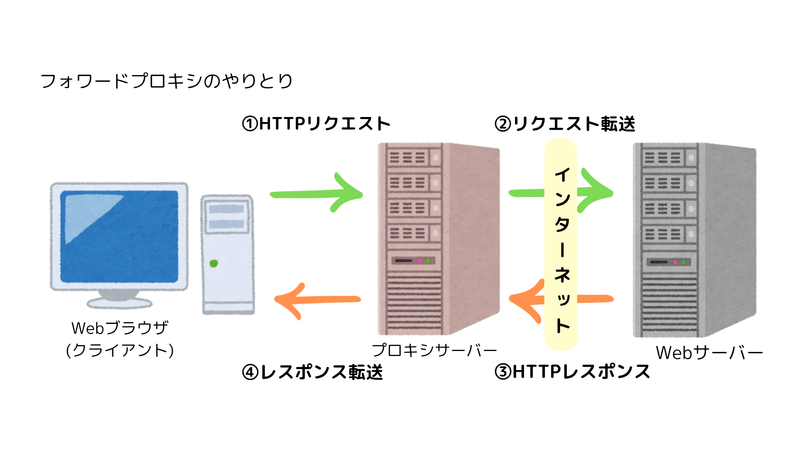

# 【Web】プロキシとポリシー

#ポリシーとは
ポリシーとは、情報の取り扱いに関する方針やルールを文書の形でまとめたもの。  
組織が情報を適切に管理して、リスクを最小限に抑えるための基盤となる。

例：プライバシーポリシー → 個人情報の扱いをどうするのか？  
 セキュリティポリシー → 情報の安全を守るためにどうするのか？

- 基本方針、対策基準、実施手順を策定する。

# プロキシとは

プロキシとは、  
インターネットを接続する際のアクセスを代理で行うシステムのこと。

プロキシサーバーは、組織のセキュリティポリシーを設定し、アクセス制御を行うことができる。

- プロキシの種類
  - フォワードプロキシ・・・主にクライアント側に設置される。
  - リバースプロキシ・・・サーバー側に設置される。大きな企業の Web サイトなど。
  - 透過型プロキシ・・・プロキシの設定方法の一つ。管理側のネットワーク制御により、強制的にプロキシサーバーを経由させる。

☀︎SWG・・・セキュア Web ゲートウェイ。プロキシサーバーの機能を拡張したもの。
 

- メリット

  - 匿名性の確保 → サイト提供者側にアクセス元(クライエントの IP アドレス)を隠せる。
  - アクセスログの取得 → クライアント PC の閲覧状況を把握。インシデント発生時も、被害状況の把握と迅速な対応を取れる。
  - アクセスの向上 → キャッシュを保存し、Web サイトの表示を高速化できる。（キャッシュサーバーの機能）
  - アクセスの制限 → 社内のポリシーに反する Web サイトへのアクセスを阻止する URL フィルタリングができる。
  - ウイルスチェック機能 → 内部ネットワークへのウイルスの侵入を防止する。

- デメリット
  - 通信速度の低下 → 経由することによりプロセスが増えるため。
  - セキュリティリスク → 悪意ある代理サーバーであった場合はデータが流出する。  
     

- 公開プロキシ・・・インターネット上に開かれており誰でも利用することができる。匿名レベルが高く悪用リスクが多い。
- 非公開プロキシ・・・特定のユーザーだけが利用できる。

☀︎ファイアウォール☀︎

ネットワークの出入り口に設置し、不正アクセスを防ぐ。 
パケットフィルター型ファイアウォールは、 
送受信されるデータ（パケット）のIPアドレスとポート番号をチェックし、通信の許可や遮断を行う。

  

#### 参考にしたサイト

- [https://www.softbanktech.co.jp/special/blog/it-keyword/2022/0030/#content01]
- [https://www.netone.co.jp/media/detail/20221003-1/]
