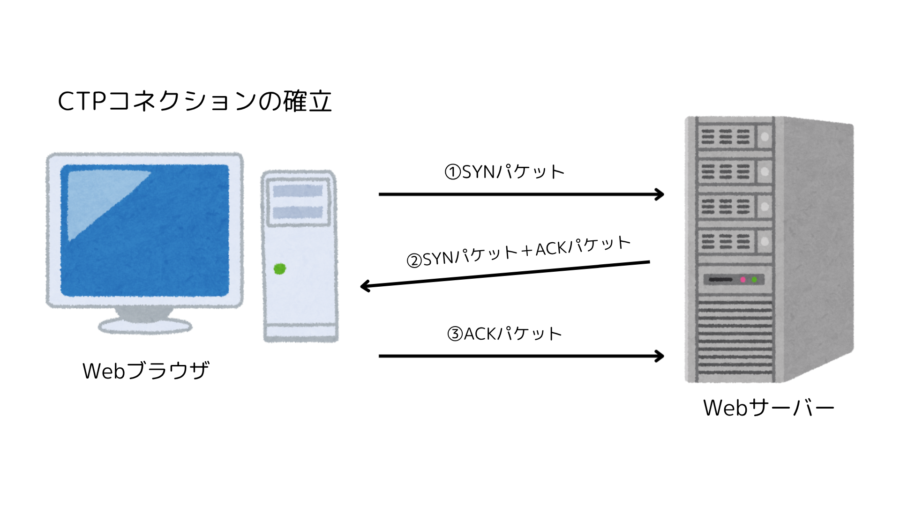
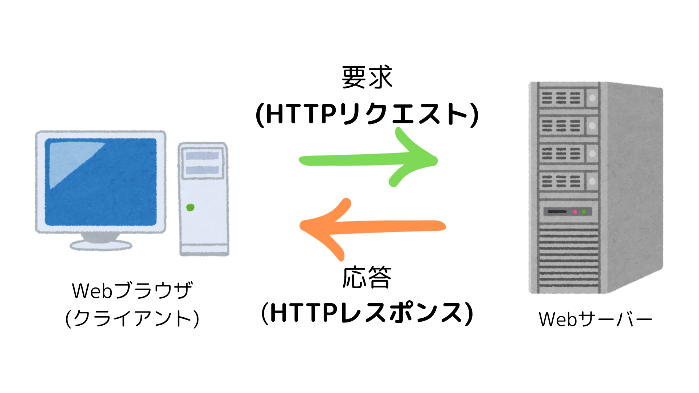

# 【Web】プロトコルと HTTP/HTTPS

# プロトコルとは

プロトコルとは、あらかじめ決められたやりとりの手順。情報規約。  
「手順」を表す言葉で、ネットワークに接続された機器同士が通信するための共通ルールや規格のこと。

- HTTP・・・ハイパーテキスト(Web コンテンツ)を送受信するためのプロトコル
- FTP・・・ファイル送受信用のプロトコル
- SMTP・・・メール送信用のプロトコル
- POP・・・メール受信用のプロトコル

TCP /IP
とは、複数のプロトコルの集まりのこと。  
異なる OS などの機器間でも接続するためのプロトコルで、
HTTP もアプリケーション層の一つとして含まれている。

☀︎TCP/IPの階層構造☀︎

アプリケーション層(レイヤー4)・・・HTTP、SMTP、FTPなど 
トランスポート層 (レイヤー3)・・・TCP、UDP 
インターネット層(レイヤー2)・・・IP、ICMPなど 
ネットワークインターフェイス層(レイヤー1) ・・・イーサネット、Wi-Fiなど 
☀︎環境や用途に応じて各層のプロトコルを使い分けるイメージ

従来の TCP/IP に代わる、QUIC という UDP を基盤にした新しい通信プロトコルの採用が広がっている。

 

# HTTP とは

HTTP とは、Web を利用して情報をやりとりするデータ送受信用のプロトコル。  
Web ブラウザと Web サーバーの間での通信に使われている。  
Hypertext Transfer Protocol の略。

- **3 ウェイハンドシェイク**とは、TCP コネクションを確立させるためのやりとり。HTTP の通信が可能になる。

#　 HTTPS とは
HTTPS とは、HTTP と SSL/TLS を組み合わせた通信の総称。  
通信路を暗号化して、HTTP よりセキュリティを高めた方法。  
Hypertext Transfer Protocol Secure の略。

- HTTP と基本的な構造は同じ。
- HTTP から HTTPS へ移行しつつある。（SSL 化）
- HTTPS が使用されている場合は、Web ブラウザのアドレスバーに鍵のアイコンが表示される。
- **SSL/TLS**とは、暗号化方式のプロトコルで

  - 暗号化通信により盗聴防止
  - メッセージダイジェストによる改ざん防止
  - SSL サーバー証明書によりなりすまし防止  
    の３つの仕組みで Web サイトの安全性を確保している。 

- **SSL/TLS ハンドシェイク**とは、Web ブラウザと Web サーバーの間で HTTPS の通信を開始するためのやりとり。TCP コネクションが確立された後に行われる。

#　 HTTP メッセージとは

HTTP メッセージとは、  
Web ブラウザ（クライエント）と Web サーバーの間で情報をやりとりするために使うデータ形式のこと。

Web ブラウザから Web サーバーへの要求を送るHTTP リクエスト  

HTTP リクエストを処理し、その結果を Web ブラウザに返すHTTP レスポンス  
の２種類に分けられる。

- HTTP では基本的に、1 つの HTTP リクエストに対して、1 つの HTTP レスポンスを返す。
- HTTP リクエストと HTTP レスポンスのやり取りを繰り返し行うことで、Web サイトを閲覧できる。
