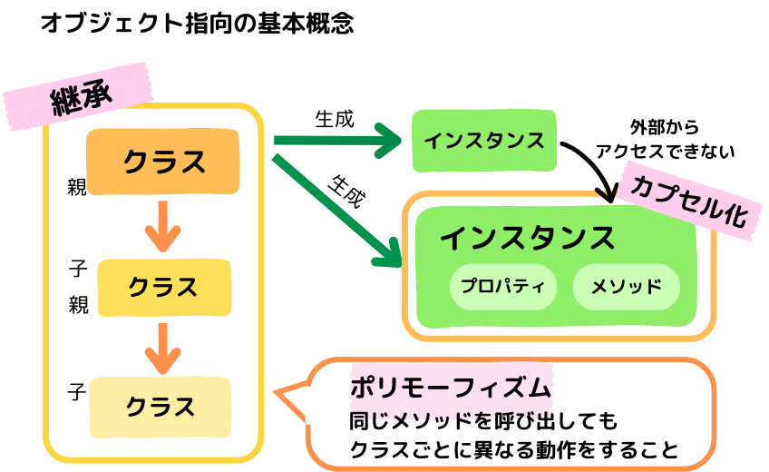

# 【PHP】オブジェクト指向のクラスと基本概念

# オブジェクト指向(OOP)とは

プログラムをデータとそれを操作する処理の流れを一つのまとまりにした  
<span style="background: linear-gradient(transparent 60%, #ffff00 60%);">「オブジェクト」を基本の単位で考え、プログラム全体をオブジェクト同士の関係として設計</span>する手法。

オブジェクトを組み合わせることで、  
各オブジェクトのプログラムの役割が明確になり、変更や保守・拡張等を行いやすくなる。

<div style="height: 12px;"><span style="margin-left: 8px; padding: 6px 10px; background:#FBB161 ; color: #ffffff; font-weight: bold; border-radius: 5px;">☀︎オブジェクト指向の用語☀︎</span></div>
<div style="border: 2px solid#FBB161 ; padding: 25px 12px 10px; font-size: 1em; border-radius: 5px;">
<b>・オブジェクト</b>・・・プロパティとメソッドをまとめたもの。<br>
<b>・クラス</b>・・・・・・オブジェクトを作る設計図。<br>
<b>・インスタンス</b>・・・クラスを使ってオブジェクトを生成したもの。実体。<br>
<b>・プロパティ</b>・・・・クラス内で定義された変数のこと。データ・属性。<br>
<b>・メソッド</b>・・・・・クラス内で定義された関数のこと。動作・機能。<br>
　　　　　　　　　　データ(プロパティ)を操作するのがメソッド<br>
</div>

<br>

# クラスのメンバ

**メンバ**とは、  
クラス内に定義する「フィールド変数(メンバ変数、プロパティ)」「メソッド(関数)」「コンストラクタ」などの総称。

<span style="background: linear-gradient(transparent 40%, #F9C1CF 100%);">クラスメンバ</span>と<span style="background: linear-gradient(transparent 40%, #F9C1CF 100%);">インスタンスメンバ</span>の２種類があり、「static」修飾子の有無で見分ける。

##### 変数(プロパティ)

- **クラス変数**

  - 定義・・・「static」を使う。
  - 呼出・・・「クラス名::$プロパティ名」、クラス内からは「self::プロパティ名」

  - インスタンスを生成しなくてもクラス名から呼び出しできる。
  - 検索結果の合計件数に使える。（どのユーザーが検索しても同じ値になる）
    <br>

- **インスタンス変数**

  - 定義・・・static を使わない。
  - 呼出・・・「インスタンス名->プロパティ名」、クラス内からは「$this->プロパティ名」

  - お買い物かごの合計点数に使える。（ユーザーごとに値が変わる）

##### 関数(メソッド)

- **クラス関数**

  - 定義・・・「static」を使う。
  - 呼出・・・「クラス名::$メソッド名」 、クラス内からは「self::メソッド名」

  - インスタンスを生成しなくてもクラス名から呼び出しできる。
  - 共通の挨拶文の表示に使える。（どのユーザーからも同じ文になる。）

- **インスタンス関数**

  - 定義・・・static を使わない。
  - 呼出・・・「$インスタンス名->メソッド名、クラス内からは「$this->メソッド名」

  - ユーザーごとの表示に使える（変数を使えてユーザーごとに文が変わる。）

```php

<?php
class Product{
   public static $classCount = 1;
   public $instanceCount = 2;
   public static function getClassName(){
      echo "こんにちは、ゲストさん。";
   }
   public function getInstanceName($name) {
       echo "こんにちは、{$name}さん。";
   }
}
echo Product::getClassName(); 　　　　　　　　  //クラス関数を呼出
echo "検索件数：".Product::$classCount."件";  　//クラス変数を呼出

$product = new Product();　　　　　　　　　　　　//インスタンス生成

$product->getInstanceName("山田");  　　　　　　 //インスタンス関数を呼出
echo "合計点数：".$product->instanceCount."点";　//インスタンス変数を呼出
?>
```

# アクセス修飾子

アクセス修飾子とは、  
変数・メソッド・クラスを定義するときに、名前の前につけてアクセスできる範囲を指定するキーワード。

<table>PHPでは
  <tr>
    <th width="120"></th>
    <th width="150" style="text-align: center;">クラス内</th>
    <th width="150" style="text-align: center;">子クラス</th>
    <th width="150" style="text-align: center;">外部</th>
  </tr>
  <tr>
    <td><b>public</b></td>
    <td style="text-align: center;">○</td>
    <td style="text-align: center;">○</td>
    <td style="text-align: center;">○</td>
  </tr>
  <tr>
    <td><b>protected</b></td>
    <td style="text-align: center;">○</td>
    <td style="text-align: center;">○</td>
    <td style="text-align: center;">×</td>
  </tr>
  <tr>
    <td><b>private</b></td>
    <td style="text-align: center;">○</td>
    <td style="text-align: center;">×</td>
    <td style="text-align: center;">×</td>
  </tr>
</table>

- クラス内のプロパティを基本「private」として隠し、必要な情報や操作だけ「public」で公開する。

- アクセス修飾子を省略して宣言すると「public」になる。

# オブジェクト指向の 3 つの基本概念

[]

（図解でカプセル化の範囲は、実体のメンバを隠蔽するという意味で、クラスではなくインスタンスを囲んでみました。）</p>

#### ① カプセル化

カプセル化とは、  
オブジェクト内に
<span style="background: linear-gradient(transparent 60%, #ffff00 60%);">データとそれを操作する手続きをまとめて外部から隠す</span>こと。

- クラス内の変数を<span style="background: linear-gradient(transparent 40%, #F9C1CF 100%);">クラスの外から操作できないようにする</span>ことで、  
  外部からの不正なアクセスや誤ってデータを変更してしまうことを防ぐ。

- 外部からデータ取得や変更するには getter/setter メソッドを通して行う。

```php
<?php
class Product {
  private $name;
  public function __construct($name) {
    $this->name = $name;
  }
  public function getName() {　　　　　　　 //ゲッターを定義
    return $this->name;
  }
  public function setName($name) {　　　　 //セッターの定義
    $this->name = $name;
  }
}
$product = new Product("Tシャツ");

//アクセス不可エラー
//echo $product->name;
?>

//ゲッターで名前を取得
<p><?php echo $product->getName() ?></p>　　<!--結果　Tシャツ-->

<?php
// セッターで名前変更
  $product->setName("スウェット");
?>
//ゲッターで変更後の名前を取得
<p><?php echo $product->getName() ?></p>　　<!--結果　スウェット-->
```

☀︎ private $name;は外部から直接アクセスできない。

#### ② 継承(インヘリタンス)

継承とは、  
<span style="background: linear-gradient(transparent 60%, #ffff00 60%);">親クラスで定義しているデータやメソッドを、子クラスに引き継ぐ仕組み。</span>

- 親クラスの機能を子クラスでも利用したいときは「private」ではなく、  
  <span style="background: linear-gradient(transparent 40%, #F9C1CF 100%);">「protected」や「public」</span>で定義しておく。

- 子クラスを定義するときは、  
  `class 子クラス名 extends 親クラス名`と書く。

- 親クラスは、既にある元となるクラスで、**スーパークラス**や基底クラスとも呼ぶ。  
  子クラスは、継承先の新しいクラスで、**サブクラス**や派生クラスとも呼ぶ。

- 継承は**is-a 関係**が成り立つとき使用することが推奨される。(例：靴は商品である)

- コードの再利用性が高まりプログラムを簡潔にかけるが、  
  使いすぎると設計が複雑になるので注意する。

- 共通するところは親クラスにまとめて書き、個別の違いは子クラスで追加し拡張する。

```php
<?php
//親クラス定義
class Product{
　protected $name;
}
//子クラス定義
class Shoes extends Product {
　public function __construct($name) {
　　$this->name= $name;   //継承したため$name使用可能、上書き
　}
　public function getName() {
　　echo $this->name;　　
　}
}
$shoes = new Shoes("スニーカー");
$shoes->getName();　　　　//結果　スニーカー

//protectedは外部からはアクセスエラー
//echo $shoes->name;
?>

```

☀︎protected $name;は継承した子クラスでも使える。

#### ③ ポリモーフィズム

継承した子クラスでメソッドを再定義することを「オーバーライド」といい、  
それにより<span style="background: linear-gradient(transparent 60%, #ffff00 60%);">同じメソッドを呼び出してもクラスごとに異なる動作に変更すること</span>を  
「ポリモーフィズム」という。多相性・多態性ともいう。

- オブジェクト間で共通の名前を持たせて、共通のルールをつくる。  
  (名前を取得するときは、いつも getName()を呼び出すなど)
- オーバーライドすると親クラスのメソッドが上書きされ、子クラスで定義した動作になる。
- オーバーライドしないときは、親クラスで定義した動作がそのまま使われる。

```php
<?php
class Product{
  protected $price;
  public function __construct($price) {
    $this->price = $price;
  }
  public function getTaxIncludedPrice(){
    return $this->price;
  }
}
//子クラス①を定義
class Books extends Product{
  public function getTaxIncludedPrice() {
    return "本：".($this->price * 1.1)."円";
  }
}
//子クラス②を定義
class Sweets extends Product{
  public function getTaxIncludedPrice() {
    return "スイーツ：".($this->price * 1.08)."円";
  }
}
$books = new Books(1000);
$sweets = new Sweets(300);

echo $books->getTaxIncludedPrice();　　　//結果　本：1100円
echo $sweets->getTaxIncludedPrice(); 　 //結果　スイーツ：324円
?>
```

☀︎getTaxIncludedPrice() 同じメソッド名で呼び出しても、クラスごとに動作(処理内容)を変えることができる。

---

### 参考にしたサイト

- progate
- https://www.javadrive.jp/php/member/index1.html#google_vignette
- https://www.php.net/manual/ja/language.oop5.static.php
- https://beyondjapan.com/blog/2023/01/php-constructor/
- https://gray-code.com/php/oriented-object/
