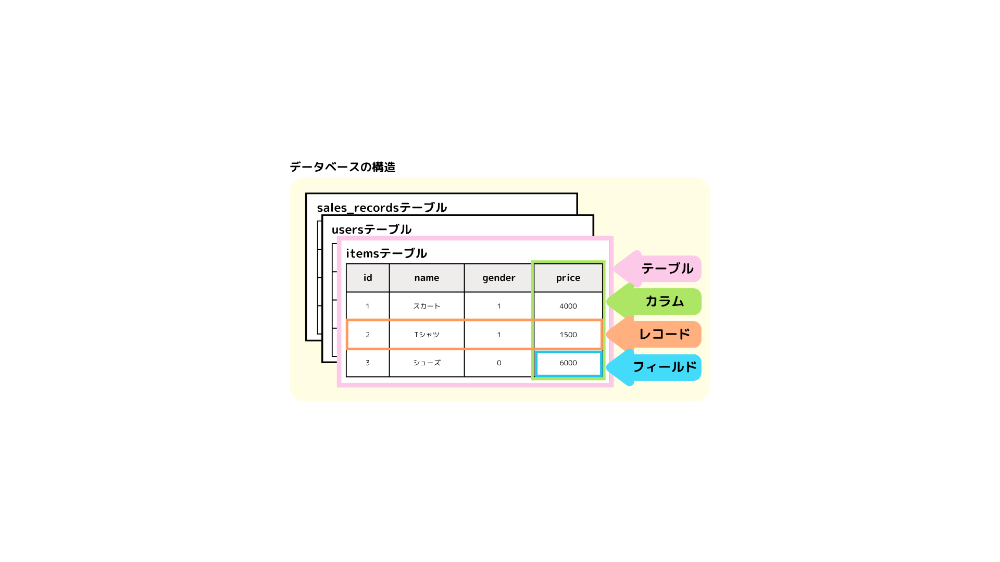

# 【DB】データベースとは

# データベース(DB)とは

様々な情報を集めて整理されたデータの集まりのこと。

- 検索や更新、分析のために蓄積され、電子的な媒体に構造化された形式で保存している。

- データベース管理システム(DBMS)によって管理される。
- 外部から直接データベースにアクセスするわけではなく、  
  DBMS にSQL 文を送信しデータベースを操作することにより、  
  データの整合性を保ち、高速なアクセスができる。

#### リレーショナル型データベース(RDB)とは

複数の表形式でデータを管理しているデータベースのこと。

- データ間の関係性を「キー」を使って連携している。
- データベース管理システム(DBMS)は、リレーショナル型データベース(RDB)が主流。
- 「MySQL」は、リレーショナル型データベースの主要な管理システム（RDBMS）の製品。
- 「phpMyAdmin」は、MySQL や MariaDB を操作するための Web ツールで、GUI 操作ができる。

- 「テーブル」・・・それぞれの表
- 「レコード」・・・行のこと。１件分のデータ単位
- 「カラム」・・・・列のこと。属性
- 「フィールド」・・レコードとカラムの交差部分にある値。データの最小単位。

#### SQL とは

SQL とはリレーショナルデータベースを操作するための言語のこと。  
データベースに要求を出す命令文のことをクエリという。

---

### 参考にしたサイト

- SL スタジオ
